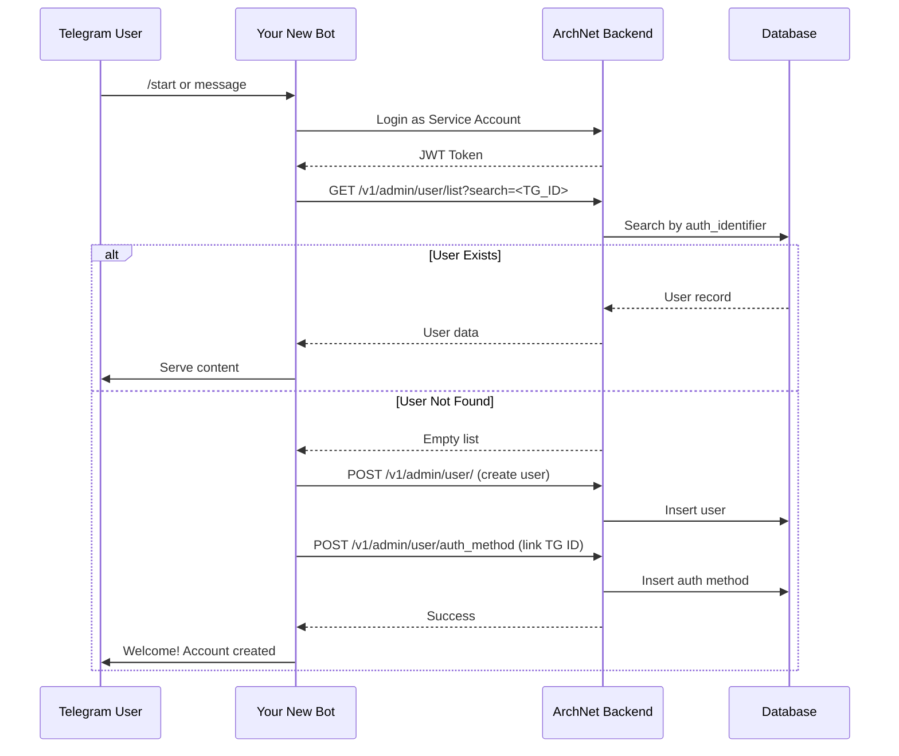

# Telegram Bot Integration Guide
## Integrating a Separate Telegram Bot with ArchNet Backend

This guide explains how to create a standalone Telegram bot that authenticates users and accesses ArchNet backend services without modifying backend code or conflicting with the existing Telegram OAuth integration.

---

## Overview

### The Problem
- ArchNet backend already has Telegram integration (OAuth + Bot for binding accounts)
- You want to create a **separate** Telegram bot for a new service
- Both bots cannot share the same bot token (webhook conflicts)
- You need instant user registration without complex verification flows

### The Solution
- **Create a new Telegram bot** with its own token
- **Use a Service Account** (admin user) for backend API access
- **Leverage Admin APIs** to check/create users instantly
- **Match users by Telegram ID** across systems

---

## Architecture



---

## Prerequisites

### 1. Create a New Telegram Bot
1. Open Telegram and message [@BotFather](https://t.me/BotFather)
2. Send `/newbot` and follow the instructions
3. **Save the Bot Token** (looks like `123456789:ABCdefGHIjklMNOpqrsTUVwxyz`)
4. This is your **NEW_BOT_TOKEN** (different from the Main Bot)

### 2. Create a Service Account in Backend
You need an admin user for the bot to authenticate.

**Option A: Via Database (Recommended for Setup)**
```sql
-- 1. Create admin user
INSERT INTO user (password, algo, is_admin, created_at, updated_at)
VALUES (
  'hashed_password_here',  -- Use tool.EncodePassWord("YOUR_STRONG_PASSWORD")
  'default',
  true,
  NOW(),
  NOW()
);

-- 2. Get the user ID (assume it's 999)
SET @bot_user_id = LAST_INSERT_ID();

-- 3. Generate refer code
UPDATE user SET refer_code = 'BOT999' WHERE id = @bot_user_id;

-- 4. Create auth method (email)
INSERT INTO user_auth_methods (user_id, auth_type, auth_identifier, verified, created_at, updated_at)
VALUES (
  @bot_user_id,
  'email',
  'bot_service@archnets.internal',
  true,
  NOW(),
  NOW()
);
```

**Option B: Via Admin Panel**
1. Log into ArchNet admin panel
2. Create new user: `bot_service@archnets.internal`
3. Set a **strong password**
4. Enable `is_admin` checkbox
5. Save credentials

> [!IMPORTANT]
> **Security**: Store these credentials securely (use environment variables, not hardcoded).
> - Email: `bot_service@archnets.internal`
> - Password: `<YOUR_STRONG_PASSWORD>`

---

## Implementation Steps

### Step 1: Bot Initialization & Authentication

When your bot starts, it must authenticate to get a JWT token.

**Pseudocode (Go with github.com/go-telegram/bot)**
```go
package main

import (
    "bytes"
    "encoding/json"
    "fmt"
    "io"
    "net/http"
    "os"
    "time"
)

const (
    BackendURL = "https://api.archnets.org" // Your backend URL
)

var (
    ServiceEmail    = os.Getenv("SERVICE_EMAIL")    // bot_service@archnets.internal
    ServicePassword = os.Getenv("SERVICE_PASSWORD") // Strong password
    JWTToken        string
    TokenExpiry     time.Time
)

type LoginRequest struct {
    Email    string `json:"email"`
    Password string `json:"password"`
}

type LoginResponse struct {
    Token string `json:"token"`
}

// Authenticate gets a fresh JWT token
func Authenticate() error {
    payload := LoginRequest{
        Email:    ServiceEmail,
        Password: ServicePassword,
    }
    
    body, _ := json.Marshal(payload)
    resp, err := http.Post(
        BackendURL+"/v1/auth/login",
        "application/json",
        bytes.NewBuffer(body),
    )
    if err != nil {
        return fmt.Errorf("login failed: %w", err)
    }
    defer resp.Body.Close()
    
    if resp.StatusCode != 200 {
        return fmt.Errorf("login returned status %d", resp.StatusCode)
    }
    
    var loginResp LoginResponse
    json.NewDecoder(resp.Body).Decode(&loginResp)
    
    JWTToken = loginResp.Token
    TokenExpiry = time.Now().Add(7 * 24 * time.Hour) // Tokens expire in 7 days by default
    
    fmt.Println("✓ Authenticated as Service Account")
    return nil
}

// EnsureAuthenticated refreshes token if needed
func EnsureAuthenticated() error {
    if time.Now().After(TokenExpiry.Add(-1 * time.Hour)) {
        return Authenticate()
    }
    return nil
}
```

### Step 2: User Lookup Function

Check if a Telegram user exists in the system.

```go
type User struct {
    Id          int64  `json:"id"`
    ReferCode   string `json:"refer_code"`
    Balance     int64  `json:"balance"`
    // Add other fields as needed
}

type UserListResponse struct {
    Total int64  `json:"total"`
    List  []User `json:"list"`
}

// FindUserByTelegramID searches for user by their Telegram ID
func FindUserByTelegramID(telegramID int64) (*User, error) {
    EnsureAuthenticated()
    
    url := fmt.Sprintf("%s/v1/admin/user/list?search=%d", BackendURL, telegramID)
    req, _ := http.NewRequest("GET", url, nil)
    req.Header.Set("Authorization", JWTToken)
    
    resp, err := http.DefaultClient.Do(req)
    if err != nil {
        return nil, err
    }
    defer resp.Body.Close()
    
    var result UserListResponse
    json.NewDecoder(resp.Body).Decode(&result)
    
    if result.Total == 0 {
        return nil, nil // User not found
    }
    
    return &result.List[0], nil
}
```

### Step 3: User Creation Function

Create a new user and link their Telegram ID.

```go
import (
    "crypto/rand"
    "encoding/base64"
)

type CreateUserRequest struct {
    Email              string `json:"email"`
    Password           string `json:"password"`
    ReferralPercentage uint8  `json:"referral_percentage"`
    OnlyFirstPurchase  bool   `json:"only_first_purchase"`
    IsAdmin            bool   `json:"is_admin"`
}

type CreateAuthMethodRequest struct {
    UserId         int64  `json:"user_id"`
    AuthType       string `json:"auth_type"`
    AuthIdentifier string `json:"auth_identifier"`
}

// GenerateRandomPassword creates a secure random password
func GenerateRandomPassword() string {
    b := make([]byte, 32)
    rand.Read(b)
    return base64.URLEncoding.EncodeToString(b)
}

// CreateUserFromTelegram creates a new user from Telegram info
func CreateUserFromTelegram(telegramID int64, username, firstName, lastName string) (*User, error) {
    EnsureAuthenticated()
    
    // Step 1: Create user account
    createUserReq := CreateUserRequest{
        Email:              fmt.Sprintf("tg_%d@telegram.bot", telegramID),
        Password:           GenerateRandomPassword(), // They won't use password login
        ReferralPercentage: 0,
        OnlyFirstPurchase:  true,
        IsAdmin:            false,
    }
    
    body, _ := json.Marshal(createUserReq)
    req, _ := http.NewRequest("POST", BackendURL+"/v1/admin/user/", bytes.NewBuffer(body))
    req.Header.Set("Authorization", JWTToken)
    req.Header.Set("Content-Type", "application/json")
    
    resp, err := http.DefaultClient.Do(req)
    if err != nil {
        return nil, fmt.Errorf("create user failed: %w", err)
    }
    defer resp.Body.Close()
    
    if resp.StatusCode != 200 {
        bodyBytes, _ := io.ReadAll(resp.Body)
        return nil, fmt.Errorf("create user returned %d: %s", resp.StatusCode, string(bodyBytes))
    }
    
    // Step 2: Get the created user to obtain user_id
    user, err := FindUserByEmail(fmt.Sprintf("tg_%d@telegram.bot", telegramID))
    if err != nil {
        return nil, err
    }
    
    // Step 3: Link Telegram ID to user
    linkReq := CreateAuthMethodRequest{
        UserId:         user.Id,
        AuthType:       "telegram",
        AuthIdentifier: fmt.Sprintf("%d", telegramID),
    }
    
    body, _ = json.Marshal(linkReq)
    req, _ = http.NewRequest("POST", BackendURL+"/v1/admin/user/auth_method", bytes.NewBuffer(body))
    req.Header.Set("Authorization", JWTToken)
    req.Header.Set("Content-Type", "application/json")
    
    resp, err = http.DefaultClient.Do(req)
    if err != nil {
        return nil, fmt.Errorf("link telegram failed: %w", err)
    }
    defer resp.Body.Close()
    
    if resp.StatusCode != 200 {
        bodyBytes, _ := io.ReadAll(resp.Body)
        return nil, fmt.Errorf("link telegram returned %d: %s", resp.StatusCode, string(bodyBytes))
    }
    
    fmt.Printf("✓ Created user %d and linked Telegram ID %d\n", user.Id, telegramID)
    return user, nil
}

// Helper function to find user by email
func FindUserByEmail(email string) (*User, error) {
    EnsureAuthenticated()
    
    url := fmt.Sprintf("%s/v1/admin/user/list?search=%s", BackendURL, email)
    req, _ := http.NewRequest("GET", url, nil)
    req.Header.Set("Authorization", JWTToken)
    
    resp, err := http.DefaultClient.Do(req)
    if err != nil {
        return nil, err
    }
    defer resp.Body.Close()
    
    var result UserListResponse
    json.NewDecoder(resp.Body).Decode(&result)
    
    if result.Total == 0 {
        return nil, fmt.Errorf("user not found")
    }
    
    return &result.List[0], nil
}
```

### Step 4: Main Bot Handler

Handle incoming messages and authenticate users.

```go
import (
    "context"
    "github.com/go-telegram/bot"
    "github.com/go-telegram/bot/models"
)

func main() {
    // Authenticate on startup
    if err := Authenticate(); err != nil {
        panic(err)
    }
    
    // Create bot
    opts := []bot.Option{
        bot.WithDefaultHandler(handleMessage),
    }
    
    b, err := bot.New(os.Getenv("NEW_BOT_TOKEN"), opts...)
    if err != nil {
        panic(err)
    }
    
    fmt.Println("🤖 Bot started!")
    b.Start(context.Background())
}

func handleMessage(ctx context.Context, b *bot.Bot, update *models.Update) {
    if update.Message == nil {
        return
    }
    
    msg := update.Message
    telegramID := msg.From.ID
    
    // 1. Check if user exists
    user, err := FindUserByTelegramID(telegramID)
    if err != nil {
        b.SendMessage(ctx, &bot.SendMessageParams{
            ChatID: msg.Chat.ID,
            Text:   "❌ Error checking user. Please try again.",
        })
        return
    }
    
    // 2. Create user if not exists
    if user == nil {
        user, err = CreateUserFromTelegram(
            telegramID,
            msg.From.Username,
            msg.From.FirstName,
            msg.From.LastName,
        )
        if err != nil {
            b.SendMessage(ctx, &bot.SendMessageParams{
                ChatID: msg.Chat.ID,
                Text:   fmt.Sprintf("❌ Failed to create account: %v", err),
            })
            return
        }
        
        b.SendMessage(ctx, &bot.SendMessageParams{
            ChatID: msg.Chat.ID,
            Text:   fmt.Sprintf("✅ Welcome! Your account has been created.\nUser ID: %d", user.Id),
        })
        return
    }
    
    // 3. User exists - serve content
    b.SendMessage(ctx, &bot.SendMessageParams{
        ChatID: msg.Chat.ID,
        Text:   fmt.Sprintf("👋 Welcome back!\nBalance: %d credits", user.Balance),
    })
}
```

---

## API Reference

### Authentication
**POST** `/v1/auth/login`

**Request:**
```json
{
  "email": "bot_service@archnets.internal",
  "password": "YOUR_STRONG_PASSWORD"
}
```

**Response:**
```json
{
  "token": "eyJhbGciOiJIUzI1NiIsInR5cCI6IkpXVCJ9..."
}
```

**Headers for all subsequent requests:**
```
Authorization: <JWT_TOKEN>
```

---

### User Lookup
**GET** `/v1/admin/user/list?search=<TELEGRAM_ID>`

**Example:** `/v1/admin/user/list?search=123456789`

**Response:**
```json
{
  "total": 1,
  "list": [
    {
      "id": 42,
      "refer_code": "ABC123",
      "balance": 1000,
      "auth_methods": [
        {
          "auth_type": "telegram",
          "auth_identifier": "123456789"
        }
      ]
    }
  ]
}
```

If user not found: `{"total": 0, "list": []}`

---

### Create User
**POST** `/v1/admin/user/`

**Request:**
```json
{
  "email": "tg_123456789@telegram.bot",
  "password": "randomly_generated_secure_password",
  "referral_percentage": 0,
  "only_first_purchase": true,
  "is_admin": false
}
```

**Response:** `200 OK`

---

### Link Telegram ID
**POST** `/v1/admin/user/auth_method`

**Request:**
```json
{
  "user_id": 42,
  "auth_type": "telegram",
  "auth_identifier": "123456789"
}
```

**Response:** `200 OK`

---

## Security Best Practices

> [!CAUTION]
> **Critical Security Measures**

1. **Environment Variables**: Never hardcode credentials
   ```bash
   export SERVICE_EMAIL="bot_service@archnets.internal"
   export SERVICE_PASSWORD="your_strong_password_here"
   export NEW_BOT_TOKEN="123456789:ABCdefGHIjklMNOpqrsTUVwxyz"
   export BACKEND_URL="https://api.archnets.org"
   ```

2. **Token Refresh**: Implement automatic token refresh before expiry
3. **Rate Limiting**: Implement rate limiting on bot commands to prevent abuse
4. **Input Validation**: Always validate user inputs before making API calls
5. **Error Handling**: Never expose internal errors to end users
6. **Logging**: Log all user creation and authentication events for auditing

---

## Testing Checklist

- [ ] Service account can authenticate successfully
- [ ] Bot can search for existing users by Telegram ID
- [ ] Bot can create new users when they don't exist
- [ ] Telegram ID is correctly linked to user account
- [ ] Users can be found on subsequent interactions
- [ ] JWT token refreshes before expiry
- [ ] Error cases are handled gracefully
- [ ] No conflicts with existing Main Bot

---

## Troubleshooting

### "Invalid Access" Error
- **Cause**: JWT token expired or service account is not admin
- **Solution**: Check `is_admin = true` in database for service account

### "User Already Exists" Error
- **Cause**: Email or Telegram ID already linked
- **Solution**: Use lookup first, only create if not found

### "Unauthorized" Error
- **Cause**: Missing or invalid token
- **Solution**: Call `Authenticate()` before making requests

### Bot Creates Duplicate Users
- **Cause**: Race condition or incorrect lookup
- **Solution**: Always check existence before creation

---

## Summary

✅ **No Backend Code Changes Required**  
✅ **Instant User Registration**  
✅ **No Conflicts with Existing Bot**  
✅ **Secure Admin API Access**  
✅ **Shared User Database**

Your separate Telegram bot now has full access to the ArchNet ecosystem while maintaining security and avoiding conflicts with existing infrastructure.
